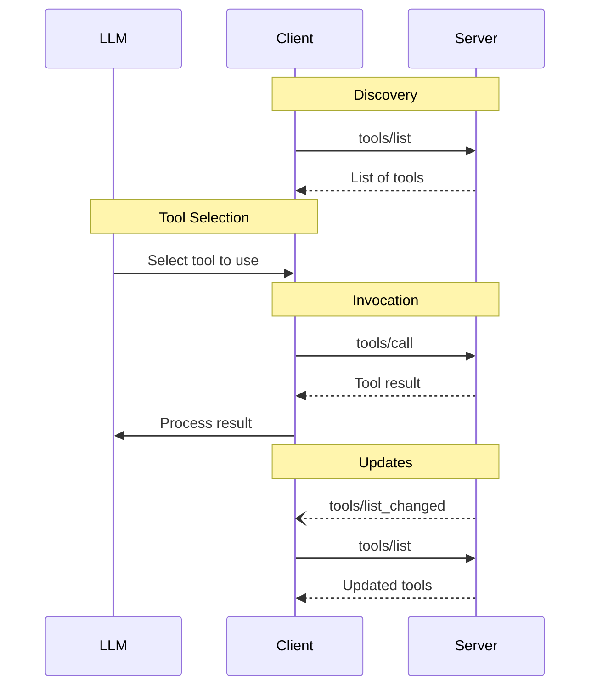
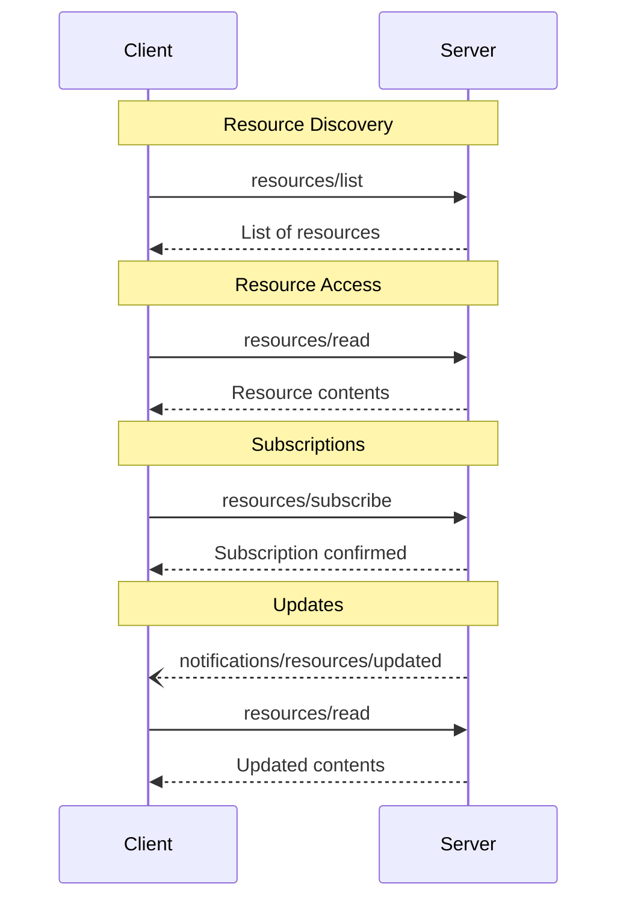
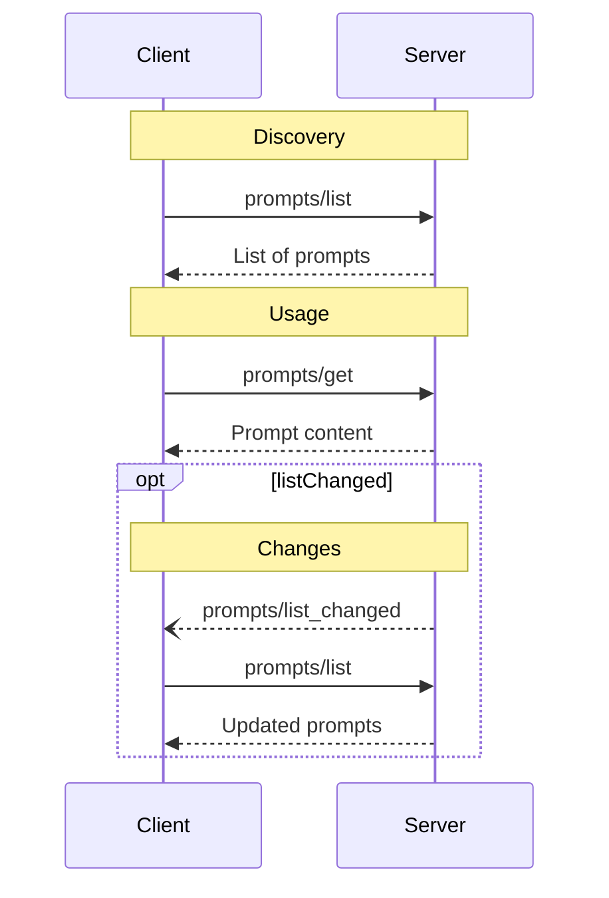

# Overview

<Info>**Protocol Revision**: 2025-06-18</Info>

Servers provide the fundamental building blocks for adding context to language models via
MCP. These primitives enable rich interactions between clients, servers, and language
models:

- **Prompts**: Pre-defined templates or instructions that guide language model
  interactions
- **Resources**: Structured data or content that provides additional context to the model
- **Tools**: Executable functions that allow models to perform actions or retrieve
  information

Each primitive can be summarized in the following control hierarchy:

| Primitive | Control                | Description                                        | Example                         |
| --------- | ---------------------- | -------------------------------------------------- | ------------------------------- |
| Prompts   | User-controlled        | Interactive templates invoked by user choice       | Slash commands, menu options    |
| Resources | Application-controlled | Contextual data attached and managed by the client | File contents, git history      |
| Tools     | Model-controlled       | Functions exposed to the LLM to take actions       | API POST requests, file writing |

Explore these key primitives in more detail below:

<CardGroup cols={3}>
  <Card title="Prompts" icon="message" href="/specification/2025-06-18/server/prompts" />

  <Card title="Resources" icon="file-lines" href="/specification/2025-06-18/server/resources" />

  <Card title="Tools" icon="wrench" href="/specification/2025-06-18/server/tools" />
</CardGroup>
# Tools

<div id="enable-section-numbers" />

<Info>**Protocol Revision**: 2025-06-18</Info>

The Model Context Protocol (MCP) allows servers to expose tools that can be invoked by
language models. Tools enable models to interact with external systems, such as querying
databases, calling APIs, or performing computations. Each tool is uniquely identified by
a name and includes metadata describing its schema.

## User Interaction Model

Tools in MCP are designed to be **model-controlled**, meaning that the language model can
discover and invoke tools automatically based on its contextual understanding and the
user's prompts.

However, implementations are free to expose tools through any interface pattern that
suits their needs—the protocol itself does not mandate any specific user
interaction model.

<Warning>
  For trust & safety and security, there **SHOULD** always
  be a human in the loop with the ability to deny tool invocations.

Applications **SHOULD**:

- Provide UI that makes clear which tools are being exposed to the AI model
- Insert clear visual indicators when tools are invoked
- Present confirmation prompts to the user for operations, to ensure a human is in the
  loop
  </Warning>

## Capabilities

Servers that support tools **MUST** declare the `tools` capability:

```json
{
  "capabilities": {
    "tools": {
      "listChanged": true
    }
  }
}
```

`listChanged` indicates whether the server will emit notifications when the list of
available tools changes.

## Protocol Messages

### Listing Tools

To discover available tools, clients send a `tools/list` request. This operation supports
[pagination](/specification/2025-06-18/server/utilities/pagination).

**Request:**

```json
{
  "jsonrpc": "2.0",
  "id": 1,
  "method": "tools/list",
  "params": {
    "cursor": "optional-cursor-value"
  }
}
```

**Response:**

```json
{
  "jsonrpc": "2.0",
  "id": 1,
  "result": {
    "tools": [
      {
        "name": "get_weather",
        "title": "Weather Information Provider",
        "description": "Get current weather information for a location",
        "inputSchema": {
          "type": "object",
          "properties": {
            "location": {
              "type": "string",
              "description": "City name or zip code"
            }
          },
          "required": ["location"]
        }
      }
    ],
    "nextCursor": "next-page-cursor"
  }
}
```

### Calling Tools

To invoke a tool, clients send a `tools/call` request:

**Request:**

```json
{
  "jsonrpc": "2.0",
  "id": 2,
  "method": "tools/call",
  "params": {
    "name": "get_weather",
    "arguments": {
      "location": "New York"
    }
  }
}
```

**Response:**

```json
{
  "jsonrpc": "2.0",
  "id": 2,
  "result": {
    "content": [
      {
        "type": "text",
        "text": "Current weather in New York:\nTemperature: 72°F\nConditions: Partly cloudy"
      }
    ],
    "isError": false
  }
}
```

### List Changed Notification

When the list of available tools changes, servers that declared the `listChanged`
capability **SHOULD** send a notification:

```json
{
  "jsonrpc": "2.0",
  "method": "notifications/tools/list_changed"
}
```

## Message Flow



## Data Types

### Tool

A tool definition includes:

- `name`: Unique identifier for the tool
- `title`: Optional human-readable name of the tool for display purposes.
- `description`: Human-readable description of functionality
- `inputSchema`: JSON Schema defining expected parameters
- `outputSchema`: Optional JSON Schema defining expected output structure
- `annotations`: optional properties describing tool behavior

<Warning>
  For trust & safety and security, clients **MUST** consider
  tool annotations to be untrusted unless they come from trusted servers.
</Warning>

### Tool Result

Tool results may contain [**structured**](#structured-content) or **unstructured** content.

**Unstructured** content is returned in the `content` field of a result, and can contain multiple content items of different types:

#### Text Content

```json
{
  "type": "text",
  "text": "Tool result text"
}
```

#### Image Content

```json
{
  "type": "image",
  "data": "base64-encoded-data",
  "mimeType": "image/png"
}
```

#### Audio Content

```json
{
  "type": "audio",
  "data": "base64-encoded-audio-data",
  "mimeType": "audio/wav"
}
```

#### Resource Links

A tool **MAY** return links to [Resources](/specification/2025-06-18/server/resources), to provide additional context
or data. In this case, the tool will return a URI that can be subscribed to or fetched by the client:

```json
{
  "type": "resource_link",
  "uri": "file:///project/src/main.rs",
  "name": "main.rs",
  "description": "Primary application entry point",
  "mimeType": "text/x-rust"
}
```

<Info>
  Resource links returned by tools are not guaranteed to appear in the results
  of a `resources/list` request.
</Info>

#### Embedded Resources

[Resources](/specification/2025-06-18/server/resources) **MAY** be embedded to provide additional context
or data using a suitable [URI scheme](./resources#common-uri-schemes). Servers that use embedded resources **SHOULD** implement the `resources` capability:

```json
{
  "type": "resource",
  "resource": {
    "uri": "file:///project/src/main.rs",
    "title": "Project Rust Main File",
    "mimeType": "text/x-rust",
    "text": "fn main() {\n    println!(\"Hello world!\");\n}"
  }
}
```

#### Structured Content

**Structured** content is returned as a JSON object in the `structuredContent` field of a result.

For backwards compatibility, a tool that returns structured content SHOULD also return functionally equivalent unstructured content.
(For example, serialized JSON can be returned in a `TextContent` block.)

#### Output Schema

Tools may also provide an output schema for validation of structured results.
If an output schema is provided:

- Servers **MUST** provide structured results that conform to this schema.
- Clients **SHOULD** validate structured results against this schema.

Example tool with output schema:

```json
{
  "name": "get_weather_data",
  "title": "Weather Data Retriever",
  "description": "Get current weather data for a location",
  "inputSchema": {
    "type": "object",
    "properties": {
      "location": {
        "type": "string",
        "description": "City name or zip code"
      }
    },
    "required": ["location"]
  },
  "outputSchema": {
    "type": "object",
    "properties": {
      "temperature": {
        "type": "number",
        "description": "Temperature in celsius"
      },
      "conditions": {
        "type": "string",
        "description": "Weather conditions description"
      },
      "humidity": {
        "type": "number",
        "description": "Humidity percentage"
      }
    },
    "required": ["temperature", "conditions", "humidity"]
  }
}
```

Example valid response for this tool:

```json
{
  "jsonrpc": "2.0",
  "id": 5,
  "result": {
    "content": [
      {
        "type": "text",
        "text": "{\"temperature\": 22.5, \"conditions\": \"Partly cloudy\", \"humidity\": 65}"
      }
    ],
    "structuredContent": {
      "temperature": 22.5,
      "conditions": "Partly cloudy",
      "humidity": 65
    }
  }
}
```

Providing an output schema helps clients and LLMs understand and properly handle structured tool outputs by:

- Enabling strict schema validation of responses
- Providing type information for better integration with programming languages
- Guiding clients and LLMs to properly parse and utilize the returned data
- Supporting better documentation and developer experience

## Error Handling

Tools use two error reporting mechanisms:

1. **Protocol Errors**: Standard JSON-RPC errors for issues like:

   - Unknown tools
   - Invalid arguments
   - Server errors

2. **Tool Execution Errors**: Reported in tool results with `isError: true`:
   - API failures
   - Invalid input data
   - Business logic errors

Example protocol error:

```json
{
  "jsonrpc": "2.0",
  "id": 3,
  "error": {
    "code": -32602,
    "message": "Unknown tool: invalid_tool_name"
  }
}
```

Example tool execution error:

```json
{
  "jsonrpc": "2.0",
  "id": 4,
  "result": {
    "content": [
      {
        "type": "text",
        "text": "Failed to fetch weather data: API rate limit exceeded"
      }
    ],
    "isError": true
  }
}
```

## Security Considerations

1. Servers **MUST**:

   - Validate all tool inputs
   - Implement proper access controls
   - Rate limit tool invocations
   - Sanitize tool outputs

2. Clients **SHOULD**:
   - Prompt for user confirmation on sensitive operations
   - Show tool inputs to the user before calling the server, to avoid malicious or
     accidental data exfiltration
   - Validate tool results before passing to LLM
   - Implement timeouts for tool calls
   - Log tool usage for audit purposes

# Resources

<div id="enable-section-numbers" />

<Info>**Protocol Revision**: 2025-06-18</Info>

The Model Context Protocol (MCP) provides a standardized way for servers to expose
resources to clients. Resources allow servers to share data that provides context to
language models, such as files, database schemas, or application-specific information.
Each resource is uniquely identified by a
[URI](https://datatracker.ietf.org/doc/html/rfc3986).

## User Interaction Model

Resources in MCP are designed to be **application-driven**, with host applications
determining how to incorporate context based on their needs.

For example, applications could:

- Expose resources through UI elements for explicit selection, in a tree or list view
- Allow the user to search through and filter available resources
- Implement automatic context inclusion, based on heuristics or the AI model's selection


However, implementations are free to expose resources through any interface pattern that
suits their needs—the protocol itself does not mandate any specific user
interaction model.

## Capabilities

Servers that support resources **MUST** declare the `resources` capability:

```json
{
  "capabilities": {
    "resources": {
      "subscribe": true,
      "listChanged": true
    }
  }
}
```

The capability supports two optional features:

- `subscribe`: whether the client can subscribe to be notified of changes to individual
  resources.
- `listChanged`: whether the server will emit notifications when the list of available
  resources changes.

Both `subscribe` and `listChanged` are optional—servers can support neither,
either, or both:

```json
{
  "capabilities": {
    "resources": {} // Neither feature supported
  }
}
```

```json
{
  "capabilities": {
    "resources": {
      "subscribe": true // Only subscriptions supported
    }
  }
}
```

```json
{
  "capabilities": {
    "resources": {
      "listChanged": true // Only list change notifications supported
    }
  }
}
```

## Protocol Messages

### Listing Resources

To discover available resources, clients send a `resources/list` request. This operation
supports [pagination](/specification/2025-06-18/server/utilities/pagination).

**Request:**

```json
{
  "jsonrpc": "2.0",
  "id": 1,
  "method": "resources/list",
  "params": {
    "cursor": "optional-cursor-value"
  }
}
```

**Response:**

```json
{
  "jsonrpc": "2.0",
  "id": 1,
  "result": {
    "resources": [
      {
        "uri": "file:///project/src/main.rs",
        "name": "main.rs",
        "title": "Rust Software Application Main File",
        "description": "Primary application entry point",
        "mimeType": "text/x-rust"
      }
    ],
    "nextCursor": "next-page-cursor"
  }
}
```

### Reading Resources

To retrieve resource contents, clients send a `resources/read` request:

**Request:**

```json
{
  "jsonrpc": "2.0",
  "id": 2,
  "method": "resources/read",
  "params": {
    "uri": "file:///project/src/main.rs"
  }
}
```

**Response:**

```json
{
  "jsonrpc": "2.0",
  "id": 2,
  "result": {
    "contents": [
      {
        "uri": "file:///project/src/main.rs",
        "name": "main.rs",
        "title": "Rust Software Application Main File",
        "mimeType": "text/x-rust",
        "text": "fn main() {\n    println!(\"Hello world!\");\n}"
      }
    ]
  }
}
```

### Resource Templates

Resource templates allow servers to expose parameterized resources using
[URI templates](https://datatracker.ietf.org/doc/html/rfc6570). Arguments may be
auto-completed through [the completion API](/specification/2025-06-18/server/utilities/completion).

**Request:**

```json
{
  "jsonrpc": "2.0",
  "id": 3,
  "method": "resources/templates/list"
}
```

**Response:**

```json
{
  "jsonrpc": "2.0",
  "id": 3,
  "result": {
    "resourceTemplates": [
      {
        "uriTemplate": "file:///{path}",
        "name": "Project Files",
        "title": "📁 Project Files",
        "description": "Access files in the project directory",
        "mimeType": "application/octet-stream"
      }
    ]
  }
}
```

### List Changed Notification

When the list of available resources changes, servers that declared the `listChanged`
capability **SHOULD** send a notification:

```json
{
  "jsonrpc": "2.0",
  "method": "notifications/resources/list_changed"
}
```

### Subscriptions

The protocol supports optional subscriptions to resource changes. Clients can subscribe
to specific resources and receive notifications when they change:

**Subscribe Request:**

```json
{
  "jsonrpc": "2.0",
  "id": 4,
  "method": "resources/subscribe",
  "params": {
    "uri": "file:///project/src/main.rs"
  }
}
```

**Update Notification:**

```json
{
  "jsonrpc": "2.0",
  "method": "notifications/resources/updated",
  "params": {
    "uri": "file:///project/src/main.rs",
    "title": "Rust Software Application Main File"
  }
}
```

## Message Flow



## Data Types

### Resource

A resource definition includes:

- `uri`: Unique identifier for the resource
- `name`: The name of the resource.
- `title`: Optional human-readable name of the resource for display purposes.
- `description`: Optional description
- `mimeType`: Optional MIME type
- `size`: Optional size in bytes

### Resource Contents

Resources can contain either text or binary data:

#### Text Content

```json
{
  "uri": "file:///example.txt",
  "name": "example.txt",
  "title": "Example Text File",
  "mimeType": "text/plain",
  "text": "Resource content"
}
```

#### Binary Content

```json
{
  "uri": "file:///example.png",
  "name": "example.png",
  "title": "Example Image",
  "mimeType": "image/png",
  "blob": "base64-encoded-data"
}
```

## Common URI Schemes

The protocol defines several standard URI schemes. This list not
exhaustive—implementations are always free to use additional, custom URI schemes.

### https\://

Used to represent a resource available on the web.

Servers **SHOULD** use this scheme only when the client is able to fetch and load the
resource directly from the web on its own—that is, it doesn’t need to read the resource
via the MCP server.

For other use cases, servers **SHOULD** prefer to use another URI scheme, or define a
custom one, even if the server will itself be downloading resource contents over the
internet.

### file://

Used to identify resources that behave like a filesystem. However, the resources do not
need to map to an actual physical filesystem.

MCP servers **MAY** identify file:// resources with an
[XDG MIME type](https://specifications.freedesktop.org/shared-mime-info-spec/0.14/ar01s02.html#id-1.3.14),
like `inode/directory`, to represent non-regular files (such as directories) that don’t
otherwise have a standard MIME type.

### git://

Git version control integration.

### Custom URI Schemes

Custom URI schemes **MUST** be in accordance with [RFC3986](https://datatracker.ietf.org/doc/html/rfc3986),
taking the above guidance in to account.

## Error Handling

Servers **SHOULD** return standard JSON-RPC errors for common failure cases:

- Resource not found: `-32002`
- Internal errors: `-32603`

Example error:

```json
{
  "jsonrpc": "2.0",
  "id": 5,
  "error": {
    "code": -32002,
    "message": "Resource not found",
    "data": {
      "uri": "file:///nonexistent.txt"
    }
  }
}
```

## Security Considerations

1. Servers **MUST** validate all resource URIs
2. Access controls **SHOULD** be implemented for sensitive resources
3. Binary data **MUST** be properly encoded
4. Resource permissions **SHOULD** be checked before operations

# Prompts

<div id="enable-section-numbers" />

<Info>**Protocol Revision**: 2025-06-18</Info>

The Model Context Protocol (MCP) provides a standardized way for servers to expose prompt
templates to clients. Prompts allow servers to provide structured messages and
instructions for interacting with language models. Clients can discover available
prompts, retrieve their contents, and provide arguments to customize them.

## User Interaction Model

Prompts are designed to be **user-controlled**, meaning they are exposed from servers to
clients with the intention of the user being able to explicitly select them for use.

Typically, prompts would be triggered through user-initiated commands in the user
interface, which allows users to naturally discover and invoke available prompts.

For example, as slash commands:


However, implementors are free to expose prompts through any interface pattern that suits
their needs—the protocol itself does not mandate any specific user interaction
model.

## Capabilities

Servers that support prompts **MUST** declare the `prompts` capability during
[initialization](/specification/2025-06-18/basic/lifecycle#initialization):

```json
{
  "capabilities": {
    "prompts": {
      "listChanged": true
    }
  }
}
```

`listChanged` indicates whether the server will emit notifications when the list of
available prompts changes.

## Protocol Messages

### Listing Prompts

To retrieve available prompts, clients send a `prompts/list` request. This operation
supports [pagination](/specification/2025-06-18/server/utilities/pagination).

**Request:**

```json
{
  "jsonrpc": "2.0",
  "id": 1,
  "method": "prompts/list",
  "params": {
    "cursor": "optional-cursor-value"
  }
}
```

**Response:**

```json
{
  "jsonrpc": "2.0",
  "id": 1,
  "result": {
    "prompts": [
      {
        "name": "code_review",
        "title": "Request Code Review",
        "description": "Asks the LLM to analyze code quality and suggest improvements",
        "arguments": [
          {
            "name": "code",
            "description": "The code to review",
            "required": true
          }
        ]
      }
    ],
    "nextCursor": "next-page-cursor"
  }
}
```

### Getting a Prompt

To retrieve a specific prompt, clients send a `prompts/get` request. Arguments may be
auto-completed through [the completion API](/specification/2025-06-18/server/utilities/completion).

**Request:**

```json
{
  "jsonrpc": "2.0",
  "id": 2,
  "method": "prompts/get",
  "params": {
    "name": "code_review",
    "arguments": {
      "code": "def hello():\n    print('world')"
    }
  }
}
```

**Response:**

```json
{
  "jsonrpc": "2.0",
  "id": 2,
  "result": {
    "description": "Code review prompt",
    "messages": [
      {
        "role": "user",
        "content": {
          "type": "text",
          "text": "Please review this Python code:\ndef hello():\n    print('world')"
        }
      }
    ]
  }
}
```

### List Changed Notification

When the list of available prompts changes, servers that declared the `listChanged`
capability **SHOULD** send a notification:

```json
{
  "jsonrpc": "2.0",
  "method": "notifications/prompts/list_changed"
}
```

## Message Flow



## Data Types

### Prompt

A prompt definition includes:

- `name`: Unique identifier for the prompt
- `title`: Optional human-readable name of the prompt for display purposes.
- `description`: Optional human-readable description
- `arguments`: Optional list of arguments for customization

### PromptMessage

Messages in a prompt can contain:

- `role`: Either "user" or "assistant" to indicate the speaker
- `content`: One of the following content types:

#### Text Content

Text content represents plain text messages:

```json
{
  "type": "text",
  "text": "The text content of the message"
}
```

This is the most common content type used for natural language interactions.

#### Image Content

Image content allows including visual information in messages:

```json
{
  "type": "image",
  "data": "base64-encoded-image-data",
  "mimeType": "image/png"
}
```

The image data **MUST** be base64-encoded and include a valid MIME type. This enables
multi-modal interactions where visual context is important.

#### Audio Content

Audio content allows including audio information in messages:

```json
{
  "type": "audio",
  "data": "base64-encoded-audio-data",
  "mimeType": "audio/wav"
}
```

The audio data MUST be base64-encoded and include a valid MIME type. This enables
multi-modal interactions where audio context is important.

#### Embedded Resources

Embedded resources allow referencing server-side resources directly in messages:

```json
{
  "type": "resource",
  "resource": {
    "uri": "resource://example",
    "name": "example",
    "title": "My Example Resource",
    "mimeType": "text/plain",
    "text": "Resource content"
  }
}
```

Resources can contain either text or binary (blob) data and **MUST** include:

- A valid resource URI
- The appropriate MIME type
- Either text content or base64-encoded blob data

Embedded resources enable prompts to seamlessly incorporate server-managed content like
documentation, code samples, or other reference materials directly into the conversation
flow.

## Error Handling

Servers **SHOULD** return standard JSON-RPC errors for common failure cases:

- Invalid prompt name: `-32602` (Invalid params)
- Missing required arguments: `-32602` (Invalid params)
- Internal errors: `-32603` (Internal error)

## Implementation Considerations

1. Servers **SHOULD** validate prompt arguments before processing
2. Clients **SHOULD** handle pagination for large prompt lists
3. Both parties **SHOULD** respect capability negotiation

## Security

Implementations **MUST** carefully validate all prompt inputs and outputs to prevent
injection attacks or unauthorized access to resources.
